 

### Software Engineer · Full Stack Developer · UI/UX Systems Specialist

  
  
  
  

---

### 👩‍💻 Sobre mim

Programadora de software em consolidação e designer de sistemas, focada em backends robustos, interfaces escaláveis e modelação de dados complexa. Estudante de **Tecnologias da Informação e Comunicação (TIC)** na **UFSC Araranguá**, com conclusão prevista para 2026.

- 🔭 Atualmente trabalhando no **ChronosBot**, meu TCC — uma plataforma de tutoria educacional com IA (FastAPI + RAG)
- 🌱 Aprofundando conhecimento em **vector databases** e integração com **LLM APIs**
- 🌐 Trabalho em contextos de português, espanhol e inglês
- ⚡ Fun fact: também modelo estruturas anatômicas em **Blender**

---

### 🚀 Projetos em destaque

<table width="100%">
  <tr>
    <td width="50%" valign="top">
      <h4>📊 <a href="https://github.com/KaroliniRPedrozo/CyphersAnalytics" target="_blank">Cypher's Analytics</a></h4>
      
Plataforma full stack para centralização e mineração analítica de dados massivos.

      
<code>.NET</code> · <code>C#</code> · <code>React</code> · <code>TypeScript</code> · <code>PostgreSQL</code>

    </td>
    <td width="50%" valign="top">
      <h4>🤖 <a href="https://github.com/KaroliniRPedrozo/ChronosBot" target="_blank">ChronosBot</a></h4>
      
Chatbot educacional (EdTech) com árvores de decisão e foco em acessibilidade e usabilidade conversacional.

      
<code>Python</code> · <code>FastAPI</code> · <code>RAG</code> · <code>LLM</code>

    </td>
  </tr>
  <tr>
    <td colspan="2" valign="top">
      <h4>📈 <a href="https://github.com/KaroliniRPedrozo/GTA-V-Charts-With-API" target="_blank">GTA V Data Analytics & Telemetry Pipeline</a></h4>
      
Pipeline de ingestão e visualização de dados de telemetria via API, com um <a href="https://github.com/KaroliniRPedrozo/GTA-V-Charts-Without-API" target="_blank">repositório espelho sem API</a> para comparação de desempenho.

      
<code>Python</code> · <code>Pandas</code> · <code>Matplotlib</code> · <code>Plotly</code>

    </td>
  </tr>
</table>

---

### 🛠️ Stack tecnológico

**Backend**
 

**Frontend & UI/UX**
 

**Dados & Cloud**
 

**Ferramentas & DevOps**
 

---

### 📊 Métricas & Estatísticas

  
  
   
  

---

### 🐍 Atividade de contribuições

  <picture>
    <source media="(prefers-color-scheme: dark)" srcset="https://raw.githubusercontent.com/KaroliniRPedrozo/KaroliniRPedrozo/output/github-contribution-grid-snake-dark.svg" />
    <source media="(prefers-color-scheme: light)" srcset="https://raw.githubusercontent.com/KaroliniRPedrozo/KaroliniRPedrozo/output/github-contribution-grid-snake.svg" />
    
  </picture>

> 💡 Gerada automaticamente pelo workflow `.github/workflows/snake.yml` incluído neste pacote — veja as instruções de instalação abaixo.

---

### 🤝 Vamos conversar?

Estou sempre aberta a colaborações em projetos open source, desafios de arquitetura e engenharia de dados.

  <a href="https://www.linkedin.com/in/karolini-ronzani-pedrozo-48124b268" target="_blank">LinkedIn</a> ·
  <a href="mailto:karolinipedrozo@gmail.com">E-mail</a> ·
  <a href="https://www.instagram.com/karolini_r/" target="_blank">Instagram</a>

